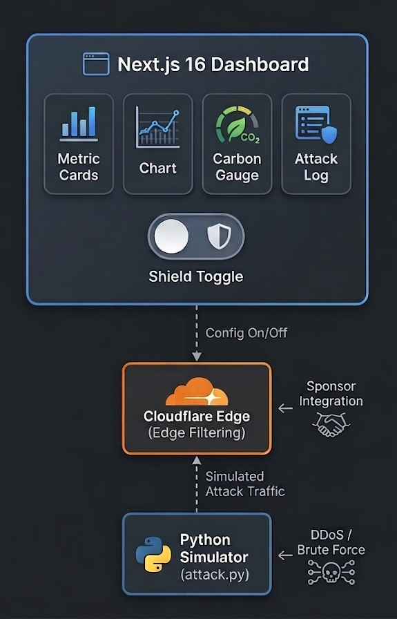

<div align="center">
  <h1>🌍 BotCarbon</h1>
  <p><em>Quantifying the carbon cost of cyber attacks — turning cybersecurity into a verifiable ESG metric.</em></p>

  [](https://botcarbon.vercel.app)
  [](https://youtube.com/watch?v=YOUR_VIDEO_ID)
  [](https://hackowasp.com)

  **SDG 13 (Climate Action) × Cybersecurity** | April 18–19, 2026
</div>

---

## 📸 See It in Action

> **Live Attack Dashboard** — Real-time traffic monitoring under DDoS attack:


> **Shield OFF** — Attack traffic consuming wasted compute:


> **Carbon Formula** — Transparent methodology: `1 req = 0.12g CO₂`


> **Attack Origins** — Geographic threat intelligence with intensity-scaled pulses:


> **Threat Log** — Terminal-style live stream of attack events:


> **Idle State** — Clean dashboard when no attack is in progress:


---

## 💡 The Problem

Nobody tracks the carbon footprint of cyber attacks.

- A single DDoS attack can consume **150+ kWh** of wasted server compute
- Global bot traffic accounts for **30-40% of all internet requests**
- This invisible energy waste generates **millions of tons of CO₂ annually**

## 🛡️ The Solution

**BotCarbon** is a real-time SOC dashboard that:

1. **Quantifies** the energy wasted by malicious bot traffic (kWh per request)
2. **Visualizes** the carbon impact with live charts and equivalency metrics
3. **Demonstrates** the environmental benefit of edge protection (Cloudflare)
4. **Proves** that cybersecurity IS sustainability

> *The "fix" for a bad BotCarbon score is literally: "Route through Cloudflare."*

## 🖥️ Dashboard Features

| Feature | Description |
|---|---|
| **Traffic Monitor** | Real-time area chart showing blocked vs. passed attack traffic |
| **Carbon Gauge** | Live CO₂ savings counter with equivalency comparisons |
| **Shield Toggle** | Enable/disable Cloudflare Edge Shield in real-time |
| **Attack Map** | Geographic threat origins with intensity-scaled pulses |
| **Threat Log** | Terminal-style live stream of attack events |
| **Formula Tooltip** | Transparent methodology: `1 req = 0.12g CO₂` |

## 📐 The Math

```
Energy per request:     0.0003 kWh (SWD Model)
Grid emission factor:   0.400 kg CO₂/kWh (US average)
CO₂ per blocked req:    0.12g

→ 1,000,000 blocked requests = 120 kg CO₂ prevented
→ Equivalent to driving 292 miles 🚗
```

*Source: Sustainable Web Design Model (SWD), DIMPACT Project*

## 🏗️ Architecture



## 📁 File Structure

```
botcarbon/
├── src/
│   ├── app/                # Next.js 16 App Router
│   │   ├── layout.tsx      # Root layout (fonts, metadata, SEO)
│   │   ├── page.tsx        # Main SOC dashboard page
│   │   └── globals.css     # Design system (glassmorphism, glow, grid)
│   ├── components/         # 8 dashboard components
│   │   ├── TrafficChart    # Real-time Recharts area chart
│   │   ├── CarbonGauge     # CO₂ savings + equivalencies
│   │   ├── ShieldToggle    # Cloudflare edge toggle
│   │   ├── AttackMap       # Geographic threat origins
│   │   ├── AttackLog       # Terminal-style event stream
│   │   ├── FormulaTooltip  # Methodology transparency
│   │   ├── MetricCard      # Glowing stat cards
│   │   └── Header          # SOC-style nav bar
│   └── lib/                # Shared utilities
│       ├── carbon.ts       # CO₂ math (SWD Model)
│       ├── constants.ts    # Attack types, thresholds
│       └── mock-data.ts    # Real-time data generation
├── scripts/
│   └── attack.py           # DDoS simulator (Python)
├── public/                 # Screenshots, logos
├── .env.example            # Environment template
└── package.json
```

## ⚡ Tech Stack

| Layer | Technology |
|---|---|
| **Frontend** | Next.js 16, React 19 |
| **Styling** | Tailwind CSS v4 |
| **Charts** | Recharts |
| **Animations** | Framer Motion |
| **Edge** | Cloudflare Edge (simulated) |
| **Fonts** | Inter, JetBrains Mono, Orbitron |
| **Deploy** | Vercel |

## 🏆 Sponsor Tracks Targeted

- **Cloudflare (Technical Partner)**: Edge Shield simulation in [`src/components/ShieldToggle.tsx`](src/components/ShieldToggle.tsx). Carbon offset calculations in [`src/lib/carbon.ts`](src/lib/carbon.ts). Attack filtering logic driven by shield state throughout the dashboard.
- **SDG 13 — Climate Action**: Core formula (`1 req = 0.12g CO₂`) from the Sustainable Web Design Model, implemented in [`src/lib/carbon.ts`](src/lib/carbon.ts).
- **Cybersecurity (OWASP-aligned)**: 8 attack types simulated (DDoS, SQL Injection, XSS, Brute Force, Credential Stuffing, etc.) — see [`scripts/attack.py`](scripts/attack.py).

## 🚀 Run It Locally (For Judges)

```bash
# 1. Clone
git clone https://github.com/edycutjong/botcarbon.git
cd botcarbon

# 2. Install
npm install

# 3. Set up env (optional — app works without any keys)
cp .env.example .env.local

# 4. Run
npm run dev
# → http://localhost:3000
```

> **📌 Note for Judges:**
> No API keys, accounts, or setup required! The dashboard runs entirely client-side with simulated real-time data. Just `npm run dev` and you're live.

### Run the Attack Simulator (Optional)

```bash
# In a separate terminal
python scripts/attack.py --intensity high
```

## 📊 Demo Script (30 seconds)

1. **0:00** — Open the dark-mode SOC dashboard. Traffic is calm.
2. **0:05** — Run `python attack.py` in a terminal. Dashboard lights up red.
3. **0:10** — Charts spike: *"Warning: Attack consuming 150 kWh of wasted compute."*
4. **0:15** — Click **"Enable Cloudflare Edge Shield"** toggle.
5. **0:20** — Attack traffic drops to zero. Green counter animates: *"150 kWh saved. 60kg CO₂ prevented."*
6. **0:25** — Show equivalencies: *"That's like preventing 146 miles of driving."*
7. **0:30** — Formula tooltip: *"1 req = 0.12g CO₂ (SWD Model)"*

## 🏷️ Track Alignment

- **Primary**: SDG 13 — Climate Action
- **Secondary**: Cybersecurity (OWASP-aligned)
- **Sponsor**: Cloudflare (Technical Partner)

## 📄 License

MIT — Built for HackOWASP 8.0

---

<div align="center">
  <strong>BotCarbon</strong> — <em>Cybersecurity IS Sustainability</em> 🌍🛡️
</div>
